# Software architecture

Dmitry Melnikov

Note: This is a lecture about software architecture in Android for [Технополис](https://polis.mail.ru/).   


## Plan

Software development challenges

Architecture definition

MVC/MVP/MVVM/MVI… architecture patterns

Pure Dependency Injection

Dependency Injection with Dagger 2

Package Structure

SOLID Principles


## Software development challenges

Expectation

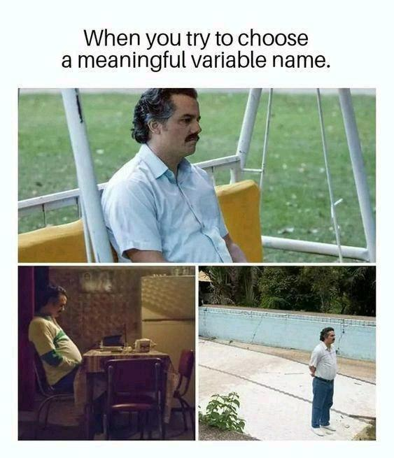


Requirements volatility


Market/Stakeholder pressure


High [coupling](https://en.wikipedia.org/wiki/Coupling_(computer_programming)) and low [сohesion](https://en.wikipedia.org/wiki/Cohesion_(computer_science))


Modification challenges

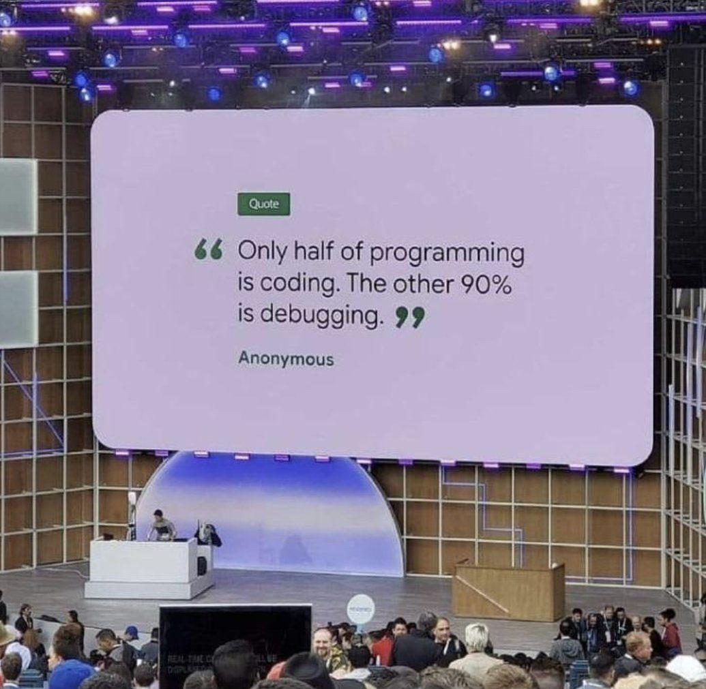


Readability


Lack of QA

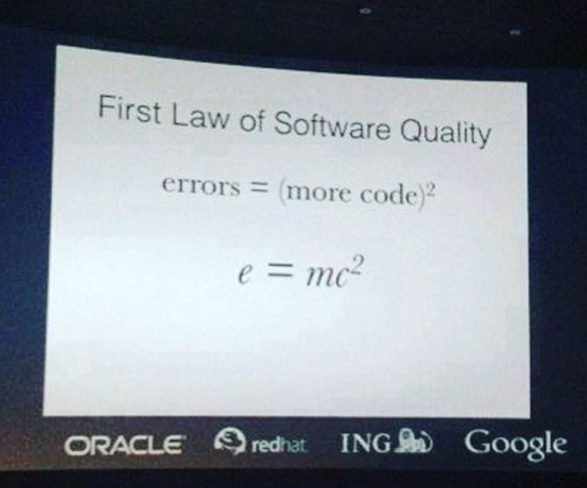


Integration challenges


## Code organization problems

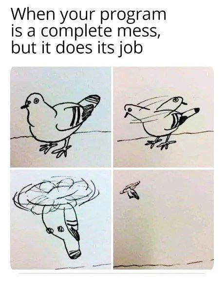

Note:

[What is high cohesion](https://stackoverflow.com/questions/10830135/what-is-high-cohesion-and-how-to-use-it-make-it)

[Difference between cohesion and coupling](https://stackoverflow.com/questions/3085285/difference-between-cohesion-and-coupling)


## Code organization problems 

Bad news: it's serious

Good news: it's fixable


## Architecture definition


### Grady Booch

Chief Scientist for Software Engineering at IBM

UML co-author

Booch method author

> Architecture represents the significant design decisions that shape a system, where significant is measured by cost of **change**.

[Wiki](https://en.wikipedia.org/wiki/Grady_Booch)


### Martin Fowler

Chief Scientist at ThoughtWorks

«Refactoring: Improving the Design of Existing Code» author

> Software architecture is the set of decisions which are both important and hard to **change**.

[Wiki](https://en.wikipedia.org/wiki/Martin_Fowler_(software_engineer)), [blog](https://martinfowler.com/), [architecture page](https://martinfowler.com/architecture/), [architecture definition video](https://www.youtube.com/watch?v=DngAZyWMGR0)


### Juval Lowy

Software architect and the principal of IDesign

Microsoft's Regional Director for the Silicon Valley

> If it does not **change**, there is no block that encapsulates it on architecture diagram.

[About](https://www.oreilly.com/pub/au/741), [IDesign](http://www.idesign.net/)


### Robert "Uncle Bob" Martin

«Clean Code» author

SOLID principles author

Agile manifesto co-author

> Architectures are not (or should not) be about frameworks.

[Wiki](https://en.wikipedia.org/wiki/Robert_C._Martin), [blog](http://blog.cleancoder.com/)


### Architecture ~ Change

Risk management decisions in anticipation of inevitable change of system's requirements.

Good architecture is resilient to changes.

Good architecture is a result of many educated trade-offs.

Mostly independent of third-party frameworks and libraries.

Good architecture severely reduces the cost (effort) of software development and maintenance. 

It's a pleasure to work with good architecture. 


No need to look for things.
    
Readable and intuitive.

Easy to reason about and modify.

Productive and less stressful. 


### More quotes

Martin Fowler:

> ...the shared understanding that the expert developers have of the system design.

Ralph Johnson:

> Architecture is about the important stuff. Whatever that is.


> High internal quality leads to faster delivery of new features

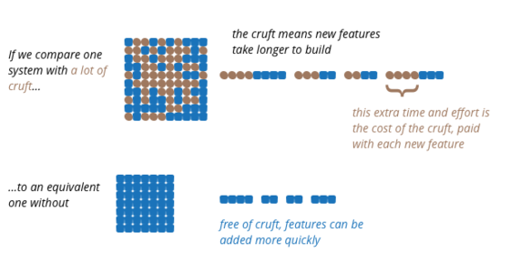

Cruft — badly designed, unnecessarily complicated, or unwanted code or software.


> Attention to internal quality pays off in weeks not months.

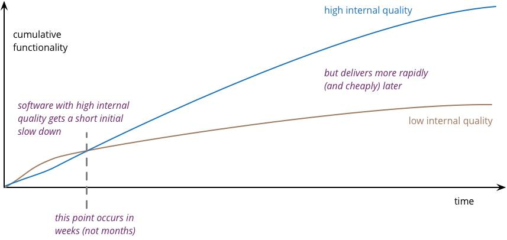


## Architectural Pattern

An architectural pattern is a general, reusable solution to a commonly occurring problem in software architecture within a given context.

Usually independent of implementation details. 

It's a bit more common thing than design patterns, not as detailed as them. 

Architectural pattern ≠ architecture.


## Presentation Domain Data Layering


https://martinfowler.com/bliki/PresentationDomainDataLayering.html


## Logical layers

UI 
* render
* ui interactions (no handling)

Application
* control flow
* handles ui interactions

Domain
* business logic

Infrastructure
* rest from domain layer (network, storage)


## MVC/MVP/MVVM/MVI…

Model: state and/or business login and/or data structures

View: user interface

X: Business logic and/or flow control logic and/or state and/or data structures


## Android Architecture Blueprints


MVP [official sample](https://github.com/android/architecture-samples) code review

```sh
git clone git@github.com:android/architecture-samples.git
git checkout todo-mvp
```


ಠ_ಠ

Too verbose View interface

View is a fragment

View calls Presenter! (from [README.md](https://en.wikipedia.org/wiki/Model-view-presenter) view should be passive)

Presenter `void result(int requestCode, int resultCode);`

View is difficult to replace with alternative implementation

View is not reusable

View and Presenter tightly coupled

View has non-UI logic

=> MVP Architecture Blueprint is not MVP


## A bit of history

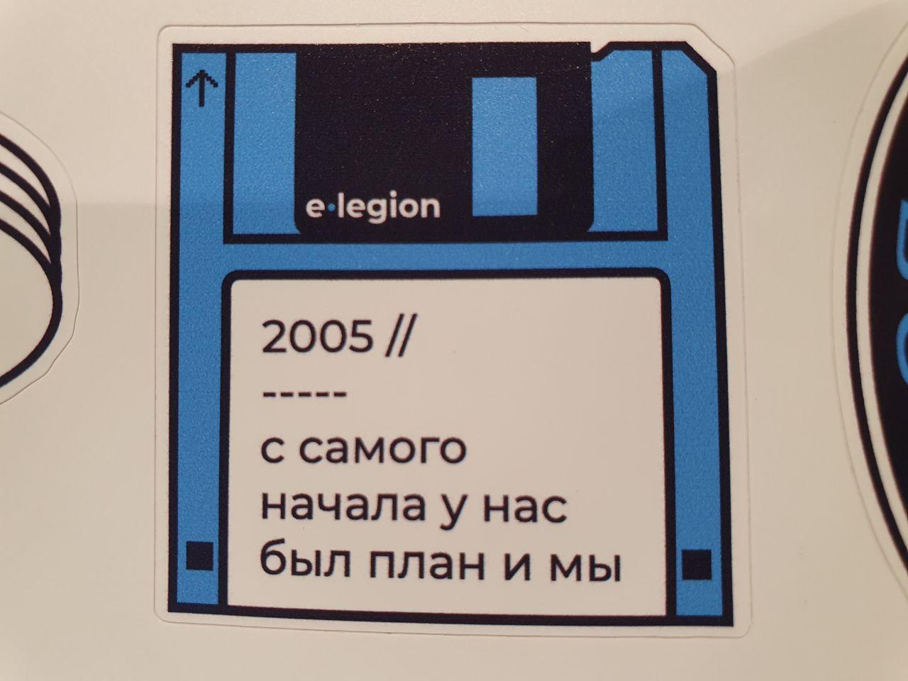


[https://mindtherobot.com/blog/675/android-architecture-message-based-mvc](https://mindtherobot.com/blog/675/android-architecture-message-based-mvc)

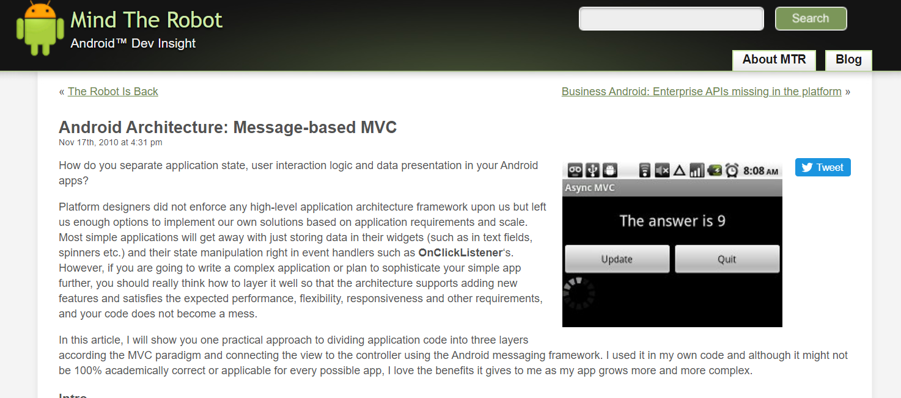


[https://www.therealjoshua.com/2012/07/android-architecture-part-10-the-activity-revisited](https://www.therealjoshua.com/2012/07/android-architecture-part-10-the-activity-revisited)

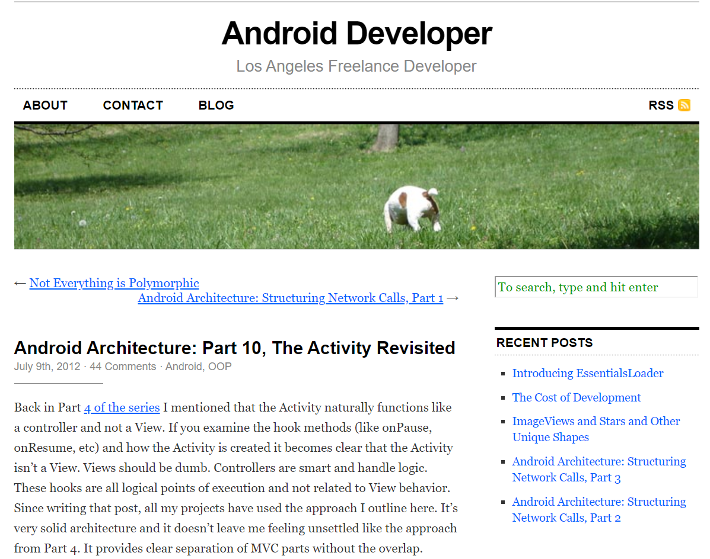

Activity not a View but more a Presenter/Controller


## MVC/MVP/MVVM/MVI… benefits

?


Testability... ?

No need for it if you don't unit test?

Better testability is just a byproduct.


The main benefit of MVx is a decoupled UI logic. 

All MVx implementations have one common thing: UI logic in views. 


## UI logic 

Responsibilities:

- render system output
- capture user interactions with the UI and route them into the system.


Characteristics:

- detailed and accurate requirements (UI mockups)
- much higher rate of change in most cases
- unreadable (verbose, messy, hacky, etc)
- easiest to test manually
- hardest to test automatically


## MVC/MVP/MVVM/MVI… benefits

Decoupled UI logic is the main benefit


## Activity/Fragment & UI logic

Example: outsourcing

UI specs + decoupled logic 
    => Outsourcing company 
    => MyActivity implements MyView

What about
- life-cycle
- screen navigation
- runtime permissions
- loaders
- fragments 
- dialogs
- di
- more...

Activity is a God Object with lots of responsibilities. 


It's difficult to integrate outsourced activity to an app. 
Activity is a God Object with many responsibilities.

It's almost impossible to decouple UI logic inside Activity. 

Fragments are the same. 

Extract UI logic to standalone class.

MyViewMvpImpl implements MyViewMvp. Obviously Activity is P.

Composition of several MyViewImpl. 


```
+---------------+                           
| Interface     |                           
|    MyViewMvp  | <----------------         
+-------|-------+                  |        
        |                          |        
+---------------+          +---------------+
|               |          | MyViewMvpImpl |
|               |          | +-----------+ |
|  Activity     |          | |           | |
|               | -------> | | UI logic  | |
|               |          | |           | |
|               |          | +-----------+ |
+---------------+          +---------------+
```


## MVx approach

Letters don't matter


MVC [wiki](https://en.wikipedia.org/wiki/Model-view-controller)

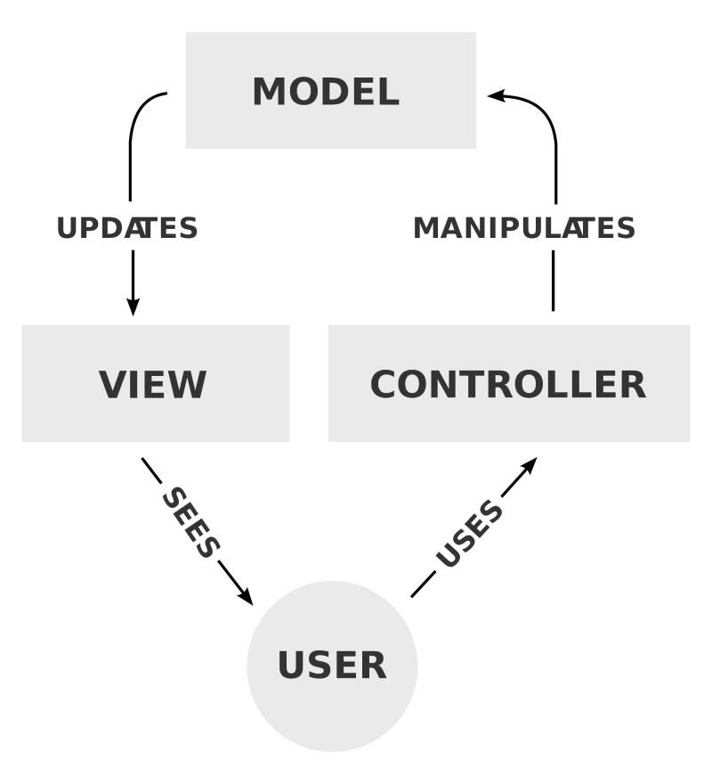

[Spring Web MVC](https://docs.spring.io/spring/docs/current/spring-framework-reference/web.html)


MVP [wiki](https://en.wikipedia.org/wiki/Model-View-Presenter)


MVVM [wiki](https://en.wikipedia.org/wiki/Model-view-viewmodel)


2010 -> 2012 -> 2014 -> 2018

My approach is variation of MVP

[Droidcon NYC 2018 - Netflix's componentization architecture with RxJava + Kotlin](https://www.youtube.com/watch?v=dS9gho9Rxn4)


## MVP Sample

```sh
git clone git@github.com:melnikovdv/android-arch.git
git checkout c48c69b
```

App shows blog posts fetched from local cache or from remote server if not cached yet.

Better way is to implement everything the "bad way" and extract UI-logic in a real-time manner, but we have no time for it. 

- blog item screen
- blog items screen


## MVP Sample ideas

Single Activity

UI logic and business logic are separated

Separated MvpView helps to understand what view does

ListView + performance workaround with ViewHolder => RecyclerView


Application layer:  Fragment

Decoupling layer:   MvpView & Listener interfaces

UI Layer:           MvpViewImpl


All the interactions in activity and fragments are high level and don't depend on implementation details. 

It's a good abstraction when you can refactor without affecting dependent classes. 


## Why not Android View as MvpView

Why not use Android View class as MvpView?

Android views are not the best candidates for MvpView implementation.

Imagine inheritance level: 

`BlogItemMvpView -> MvpViewObservable -> MvpView -> FrameLayout -> ViewGroup -> View`

Cons:
- inheritance of thousands of loc
- inheritance of 100+ methods
- standalone hierarchy for each ViewGroup

Effective Java, item 16: "Favour composition over inheritance". 


## MVP Sample summary

MVP views implement the MvpView interface with single `getRootView()`.

UI-actions calls corresponding presenters via listeners (observable).

MVP views can be nested.

Activities and fragments are not views, but presenters/controllers.

Android views aren't the best choice for MvpView.


## MVVM

MVVM [official sample](https://github.com/android/architecture-samples) code review

```sh
git clone git@github.com:android/architecture-samples.git
```

Fragments have a mix of ui logic and non-ui logic (e.g., navigation)


## MVVM sample

```sh
git clone git@github.com:melnikovdv/android-arch.git
git checkout c0e6c68
```


## MVVM sample with Data Binding

```sh
git clone git@github.com:melnikovdv/android-arch.git
git checkout ffba543
```


## MVVM summary

Pros

- less code, especially with data bindings
- quick start (no need in custom code)

Cons

- heavily dependant on the framework (MPP)
- emphasizes usage of viewModels/liveData/fragments
- usually Activity/Fragment as a View
- views are difficult to reuse
- nested views are difficult


They: tell me your wildest sexual fantasy!

Android Dev: 👇

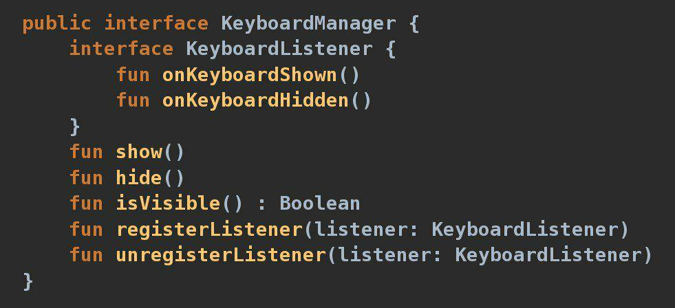


## MVI

MVVM + immutable state

MVP/MVVM FSM vs MVI state


## MVC/MVP/MVVM/MVI… summary

Decoupled UI logic

Reuse of UI and application layer logic

Testability

No additional dependencies

Easy integration with dependency injection

Standardization of the code


Cons:

Initial learning curve

Unfamiliar

A bit more code


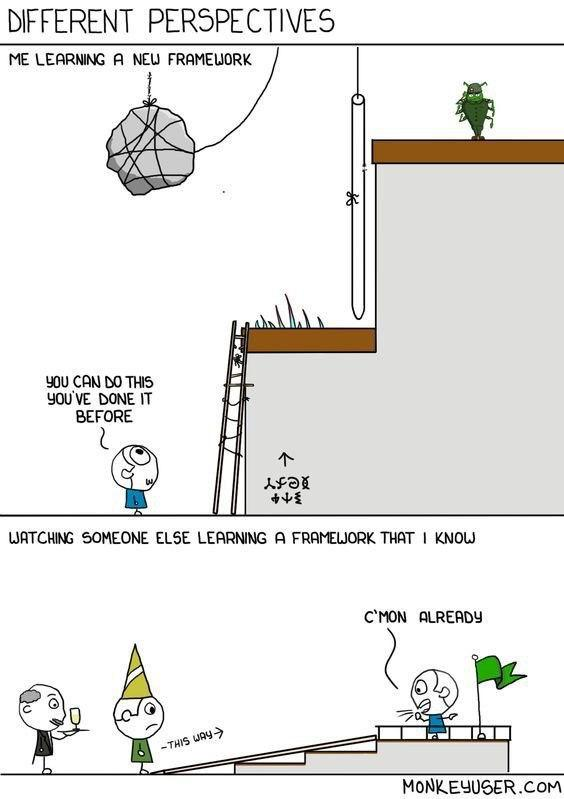


## MVC/MVP/MVVM/MVI… further reading

Hannes Dorfmann's [blog](http://hannesdorfmann.com/)

Robert Martin [blog](http://blog.cleancoder.com/) + «Clean Code»

Martin Fowler [blog](https://martinfowler.com/)

Vasily Zukanov [blog](https://www.techyourchance.com/)


## Dependency Injection

What is dependency? 

`Class A => *uses* => Class B`

`Client => *uses* => Service`

Class B both client and service:

`Class A => *uses* => Class B => *uses* => Class C`


How do clients get references to services?

- instantiation
- static method call
- gets references "outside"
- *reflection*

First two are active dependendencies resolution, the third one is dependency injection.


## Dependency Injection

Usually DI has at least two meanings:

The act of providing (injecting) the required dependencies using one of the fundamental techniques: constructor, method or field injection (DI technique).

Dependency injection architecture pattern (DIAP).


## Dependency Injection techniques

```java
public class Client {
    private final Service1 service1;
    private Service2 service2;
    public Service3 service3;

    public Client(Servcie1 service1) {
        this.service1 = service1;
    }

    public void setService2(Service2 service2) {
        this.service2 = servcie2;
    }

    public void doSmth() {
        service1.doSmth1();
        service2.doSmth2();
        service3.doSmth3();
    }
}
```


### Constructor injection

Pros:
- simple
- constructor signature reflects deps
- injected fields can be [finalized](https://shipilev.net/blog/2014/safe-public-construction/)
- easy to mock services in unit tests

Cons:
- none


### Method injection

Pros:
- method signature reflects deps
- can happen after construction

Cons:
- not as explicit as a constructor injection
- can lead to implicit ordering requirements (temporal coupling)


### Field injection

Pros:
- can happen after construction

Cons:
- all cons of the method injection
- not evident deps


Constructor dependency injection technique looks best by far. 

Prefer it to other techniques unless:
- no service instance at the moment of client instantiation (service locator)
- instantiation is out of your scope (e.g. Activity)
- limitations on constructor (e.g. Fragment)


## Dependency Injection 

Most popular [answer](https://stackoverflow.com/questions/130794/what-is-dependency-injection) at the StackOverflow:

> Dependency Injection is passing dependency to other objects or framework


It's incomplete. It's just a technique.

Should such fields be injected? `private List<A> list = new ArrayList()` 

Is it enough to pass ServiceLocator to a constructor? 

Why DI frameworks exist if DI is just a passing deps into constructors? 

If all clients get services from outside, where all of them are instantiated?


## Dependency injection architecture pattern

Segregates application logic into two sets of classes:

- **Functional set**

Contains classes that encapsulate core application functionality

- **Construction set**

Contains classes that resolve dependencies and instantiate objects from a functional set.

Each class in the app should be a part only of one of these sets. 


```                                                                  
                Application                  
+----------------+        +-----------------+
|Construction set|        | Functional Set  |
|                |        |                 |
| Class1..       | <----> |  Class1..       |
|   ClassN       |        |    ClassN       |
+----------------+        +-----------------+
```

Segregation into these sets is a **Separation of concerns**.

Concerns of core app's functionality separated from concerns of creating and wiring.


DI — separation of concerns at the highest level of abstraction. 

It's not about frameworks, annotations, or any other implementation details. 


## DI techniques vs DIAP

Different levels of abstraction (class vs application)

DI techniques - class level Single Responsibility Principle

DIAP - application level Separation of Concerns

DIAP implementations use DI techniques under the hood


## Dependency Injection sample 

Myths:

- small applications don't need DI
- it doesn't worth investments
- DIAP is about frameworks

Pure Dependency Injection (Poor Man's Dependency Injection)

Service Locator ≠ DIAP


## Dependency Injection sample

```sh
git clone git@github.com:melnikovdv/android-arch.git
git checkout bccc712
```


### Dependency Injection sample

Use of [Law of Demeter](https://en.wikipedia.org/wiki/Law_of_Demeter) makes less dependencies and more readable and maintainable code.

`BlogItemMvpFragment` dependency on `BlogItemMvpViewImpl` was eliminated in favor to `BlogItemMvpView` contract. 

Sample profit: A/B testing with different ViewImpls. We can change View without changing Activity code. 

It's OCP: an ability to modify functionality of a unit without changing its code. 


Pure DI is error-prone and forces you to write lots of code. 

Can be fixed with a DI framework. 

Dagger 2 is the most mature DI framework for now. 


## Dependency Injection with Dagger 2

Dagger 2 is the most mature DI framework for now

Uses Code generation


### Cons

Poor docs

Lack of best practices

Too many features


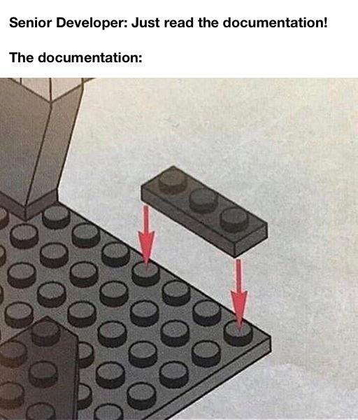


### Pros

No boilerplate code

Easier to refactor


## Dependency Injection with Dagger 2 sample

```sh
git clone git@github.com:melnikovdv/android-arch.git
git checkout 37c337c
```

Sample with constructor inject convention

```sh
git clone git@github.com:melnikovdv/android-arch.git
git checkout 5853fd9
```


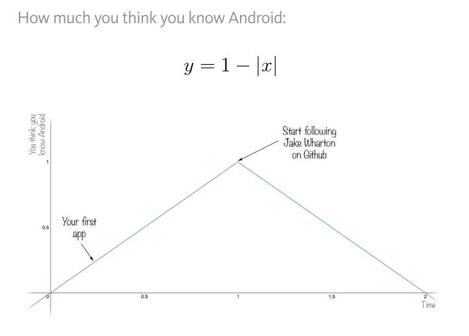


## Package structure

> So what does the architecture of your application scream? When you look at the top-level directory structure, and the source files in the highest-level package, do they scream "Health Care System" or "Accounting System" or "Inventory Management System"? Or do they scream "Rails" or "Spring/Hibernate" or "ASP"? ― Robert C. Martin, Clean Architecture


Bad: activities, fragments, services, etc.

Good: blog, article, order, checkout, etc.


## SOLID principles

**S**ingle Responsibility Principle

**O**pen Closed Principle

**L**iskov Substitution Principle

**I**nterface Sergregation Principle

**D**ependency Inversion Principle


## SOLID history

First mentioned in Robert "Uncle Bob" Martin's book.

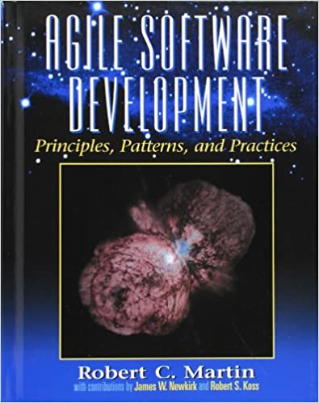


In 2004 or thereabouts, Michael Feathers sent me an email saying that if I
rearranged the principles, their first words would spell the word SOLID — and
thus the SOLID principles were born.


It's decades of academic research and industry experience.


## Single Responsibility Principle


### SRP Definition 1

Each class should have only one *responsibility*.


### SRP Definition 2

Code is satisfied to SRP if you are able to describe what each class does without saying "and".

```java
public class AuthManager {
    public void login(String username, String password) {
        // …
    }

    public void logout() {
        // …
    }
}
```

⛔ Logs users into the system **and** logs users out of the system.

But

✔ Handles users's authentification.


### SRP Definition 3

Each class should have only one reason to change.


### SRP example

Uncle Bob's [blog post](https://blog.cleancoder.com/uncle-bob/2014/05/08/SingleReponsibilityPrinciple.html)

```java
public class Employee {

  public Money calculatePay();
  
  public void save();
  
  public String reportHours();
}
```


### SRP and reusability

```
+-------------------------------+
|        class Feature1         |
| +------------+ +------------+ |
| |    doA()   | |   doB()    | |
| +------------+ +------------+ |
+-------------------------------+

```


### SRP and reusability

```
+-------------------------------+
|        class Feature1         |
| +------------+ +------------+ |
| |    doA()   | |   doB()    | |
| +------------+ +------------+ |
+-------------------------------+

```

```
+-------------------------------+
|        class Feature2         |
| +------------+ +------------+ |
| |    doA()   | |   doC()    | |
| +------------+ +------------+ |
+-------------------------------+
```

```
+-------------------------------+
|        class Feature3         |
| +------------+ +------------+ |
| |    doA()   | |   doB()    | |
| +------------+ +------------+ |
+-------------------------------+
```


### SRP summary

Practical definition: each class should have only one reason to change.

How to follow SRP:

List all the requirements

Analyze them for reasons to change

Extract to standalone classes

Pros: 

Small and easy to understand components

Most probable to changes functions are encapsulated in standalone classes

Easier to reuse

High cohesion and low coupling


## Abstraction

Abstraction is an alternative representation of a concept that hides irrelevant details and exposes only the properties you are interested in.

> "If you can't explain it to a six year old, you don't understand it yourself." ― Albert Einstein


## Abstraction example

Coffee machine hides all the details how to boil cappucino. 


Software abstraction example

```
CPU -> Firmware -> OS -> Application
```

Application abstraction example 

```
Statement 
    -> Method (expose operations) 
        -> Object (expose functional behavior) 
            -> Module (expose domain concept) 
                -> Application
```


## Abstraction summary

Interface and Implementation

Essential abstractions:
- external dependencies (services, libraries, frameworks, system)
- IO (file, network)
- database


## Open Closed Principle

Software entities (classes, modules, functions) should be open for extension, but closed for modification. 


## OCP history

> Open Closed Principl: Modules should be open and closed — Bertrand Meyer, 1988

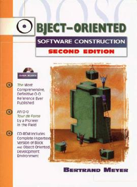


## OCP history

> A module is said to be open if it is still **available for extention**. For example, it should be possible to expand its set of operations or add fields to its data structures

> A module is said to be closed if it is **available for use by other modules**. This assumes that the module has been given a **well-defined, stable description** (its interface in the sense of information hiding). At the implementation level, closure for a module also implies that **you may compile it**, perhaps **store it in a library**, and make it available for others (its clients) to use. 


## OCP history

No changes after modules released to clients

It's possible to extend all modules

> Design and document for inheritance or else prohibit it. — Joshua Bloch, Effective Java


## OCP history

Robert "Uncle Bob" Martin, Agile Software Developments: Principles, Patterns, and Practices. 

> How is it possible that the behaviors of a module can be modified without changing its source code? Without changing the module, how can we change what a module does?


> **The answer is abstraction**. In C# or any other object-oriented programming language (OOPL), it is possible to create abstractions that are fixed and yet represent an unbounded group of possible behaviors. The abstractions are abstract base classes, and the unbounded group of possible behaviors are represented by all the possible derivative classes.

> It is possible for a module to manipulate an abstraction. Such a module can be closed for modification, since it depends on an abstraction that is fixed. Yet the behavior of that **module can be extended by creating new derivatives of the abstraction**.


## OCP definition

Software entities (classes, modules, functions) should be open for extension, but closed for modification. 

≈

Depend on stable abstractions and change system's behaviour by providing different implementations. 

OCP is polymorphism principle. 

Further reading: [Protected Variation: The importance of being Closed](https://www.martinfowler.com/ieeeSoftware/protectedVariation.pdf)


## OCP example

### Brewing coffee before

```java
public class CoffeeMachine {

    public void brew(Order order) {
        if (order.getType() == Type.ESPRESSO) {
            // brew espresso
        } else if (order.getType() == Type.CAPPUCCINO) {
            // brew cappuccino
        } else {
            // brew other
        }
        // …
    }
}
```


### Brewing coffee after

```java
public class CoffeeMachineOCP {

    private final BrewerFactory brewerFactory;

    public CoffeeMachineOCP(BrewerFactory brewerFactory) {
        this.brewerFactory = brewerFactory;
    }

    public void brew(Order order) {
        Brewer brewer = brewerFactory.getBrewer(order.getType());
        brewer.brew();
    }
}
```


## OCP summary

OCP minifies challenges in predictable changes

Limitations
- not applicable to all classes in the app
- can't monify challenges from all possible changes

You need some experience to extract right abstractions

If done right it's easy to provide additional business value


## Liskov Substitution Principle

If S is a subtype of T, then objects of type T may be replaced with objects of type S (i.e. an object of type T may be substituted with any object of a subtype S) without altering any of the desirable properties of the program (correctness, task performed, etc.)

Simple example:

`class Rectnagle` and `class Square`

If square is a subtype of Rectangle, everywhere I use `Reactangle` I can substitute it with `Square` without any failures. 

What is subtype? How can I determine LSP violations ahead of time? 


## LSP history

Barbara Liskov, [Turing Award laureate](https://amturing.acm.org/award_winners/liskov_1108679.cfm) 2008.

> For contributions to practical and theoretical foundations of programming language and system design, especially related to data abstraction, fault tolerance, and distributed computing.

[Data Abstraction and Hierarchy](https://pdfs.semanticscholar.org/36be/babeb72287ad9490e1ebab84e7225ad6a9e5.pdf), 1987.


> Abstractions can be used to encapsulate potential modifications. For example, suppose we want a program to run on different machines. We can accomplish this by inventing abstractions that hide the differences between machines so that to move the program to a different machine only those abstractions need be reimplemented. A good design principle is to think about expected modifications and organize the design by using abstractions that encapsulate the changes. 

≈ OCP

[Behavioral Subtyping Using Invariants and Constraints](http://reports-archive.adm.cs.cmu.edu/anon/1999/CMU-CS-99-156.pdf), 1999.


## LSP rules

```java
class ServiceSubclass extends Service {}
```

`ServiceSubclass` could be not a subtype of `Service`


### Contravariance of arguments

If subclass implements a method from its superclass, then the number of arguments should be the same.

The type of each argument in subclass method should be the supertype of the type of the respective arguments in superclass method.

```java
class Service {
    doSmth(Argument arg) { /*…*/ }
}

class ServiceSubclass extends Service {
    doSmth(SubclassArgument arg) { /*…*/ }
}
```

Don't make subclass method arguments more specific.


### Covariance of result

Either both superclass and sublass methods return result, or neigher does.

If there is a result, then the type of the result in the subclass is a subtype of the type of the result in the superclass. 

```java
class Service {
    Result doSmth() { /*…*/ }
}

class ServiceSublass extends Service {
   ResultSubclass doSmth() { /*…*/ }
}
```

Overridden method returns a result if and only if the parent method does too.

Don't make subclass methods return more general types.


### Exception rule

Exceptions thrown by a method in the subclass should be contained in the set of exceptions thrown by the respective method in the superclass. 

Checked exceptions checked by compiler, but unchecked not. 

`class HttpClientException extends IOException`

`class HttpsClientException extends IOException`

Don't throw new types of exceptions from subclasses. 


### Pre-condition rule

Pre-condition is an assertion about the state of the system before the method is called.

Pre-conditions required by methods of a subclass mustn't be stronger than pre-conditions required by methods of a superclass.  

```java
class Service {
    doSmth(Argument arg) { /*…*/ } // non null or null
}

class ServiceSubclass extends Service {
    doSmth(SubclassArgument arg) { /*…*/ } // non null
}
```

`ServiceSubclass` isn't a proper subtype because of stronger pre-conditions.

A subclass should be able to operate with all states that a superclass can operate in. 


### Post-condition rule

Post-condition is an assertion about the state of the system after method execution completes. 

Post-conditions guaranteed by methods of a subclass mustn't be weaker than post-conditions guaranteed by methods of a superclass. 

```java
class Service {
    Result doSmth() { /*…*/ } // non null
}

class ServiceSublass extends Service {
   ResultSubclass doSmth() { /*…*/ } // nullable
}
```

`ServiceSubclass` isn't a proper subtype bacause it guarantees weaker post-conditions. 

Clients shouldn't be surprised by the results of invocation of methods of a subclass. 


### Invariant rule 

Invariant is an assertion about a specific class property which is always true. 

Invariants guaranteed by a subclass must include all invariants guaranteed by a superclass. 

Ex: Number of elements in the queue <= capacity


### Constraint rule 

Constraint is an assertion about how class property evolves over time. 

Invariants can't express dynamic properties, so constraints were added. 

```java
class MessageErrorDetector {
    void processMessage(Message message) { /*…*/ }
    boolean isErrorDetected() { /*…*/ }
}
```

Constraints enforced by a subclass must include all constraints enforced by a superclass. 

```java
class MessageErrorDetectorSubclass {
    void processMessage(Message message) { /*…*/ }
    boolean isErrorDetected() { /*…*/ }
    void resetError() { /*…*/ }
}
```


### LSP example

```java
class Rectangle {
    void setWidth(int width) { /*…*/ }
    void setHeight(int height) { /*…*/ }    
}

class Square extends Rectangle {
    void setWidth(int width) { /*…*/ }
    void setHeight(int height) { /*…*/ }    
}
```

1. Contravariance of arguments
2. Covariance of result
3. Exception rule
4. Pre-condition rule
5. Post-condition rule
6. Invariant rule ⚠ Square invariant: width = height
7. Constraint rule ⚠ Rectangle constraint: setWidth() doesn't change the height


## LSP summary

Subtype is a subclass or an implementation which can be substituted for the type it extends or implements. 

> Design and document for inheritance or else prohibit it. — Joshua Bloch, Effective Java

Android example: 

`Application`, `Activity` and `Service` all extends `Context` and violite LSP. 

https://stackoverflow.com/questions/3572463/what-is-context-on-android


## Interface Segregation Principle

Clients shouldn't be forced to depend on methods the don't use. 

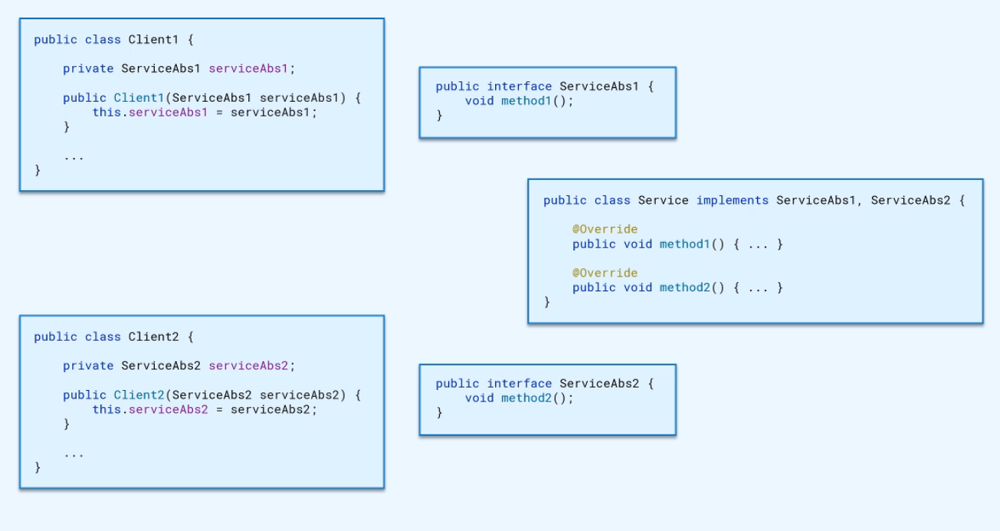

RxJava: Observable, Subject are separated according to ISP. 

AppVisibility / ScreenOn.


## ISP summary

Segregated interfaces allow to segregate functionality if/when needed. 


## Dependency Inversion Principle

High-level modules should not depend on low-level modules. Both should depend on abstractions. 

Abstractions should not depend on details. Details should depend on abstractions. 


```
   +-----------------------+  
   |     TopLevelClass     |  
   +-----------------------+  
               |              
   +-----------|-----------+  
   |     MidLevelClass     |  
   +----------/-\----------+  
           /--   --\          
        /--         --\       
+----------+      +----------+
|    F1    |------|    F2    |
+----------+      +----------+
```


```
   +-----------------------+  
   |     TopLevelClass     |  
   +-----------------------+  
               |              
   +-----------|-----------+  
   |  MidLevelAbstraction  |  
   +-----------|-----------+  
               |              
   +-----------|-----------+  
   |     MidLevelClass     |  
   +----------/-\----------+  
           /--   --\          
        /--         --\       
+----------+      +----------+
|    F1    |------|    F2    |
+----------+      +----------+
```

Inverted flow of control - IOC.

Service and Service Callback.

Works even for modules and different teams. 


## DIP summary

Protection from future changes in requirements

Reusability

Break dependency on external modules

Easier integration between modules

Better visibility and accountability

Cons:

More efforts to implement

More efforts to change

Increased code complexity


## SOLID Principles summary

Follow the principles 😳

SRP: small classes with narrow functionality

OCP: make abstractions to minify impact of changes

LSP: proper subtyping

ISP: depend only on functionality classes actually use 

DIP: inversion of flow control


## Software architecture and design patterns summary

> Managing complexity is the most important technical topic in software development. In my view, it's so important that Software's Primary Technical Imperative has to be managing complexity. Complexity is not a new feature of software development. — Steve McConnel, Code Complete.


Code complexity

```
+----------------------------------------------+
| +---------------------+                      |
| |                     |                      |
| |                     |                      |
| | +--------+ 5000 LOC |                      |
| | |500 LOC |          |                      |
| | +--------+          |                      |
| +---------------------+                      |
|                              50000 LOC       |
|                                              |
|                                              |
|                                              |
+----------------------------------------------+
```


Managing complexity = deal with small parts of the app while safely ignoring other parts

No difference between 40K LOC and 50K LOC

Separation of Concerns

The code is read much more often than it's written, especially interfaces

Code simplicity (container ships)


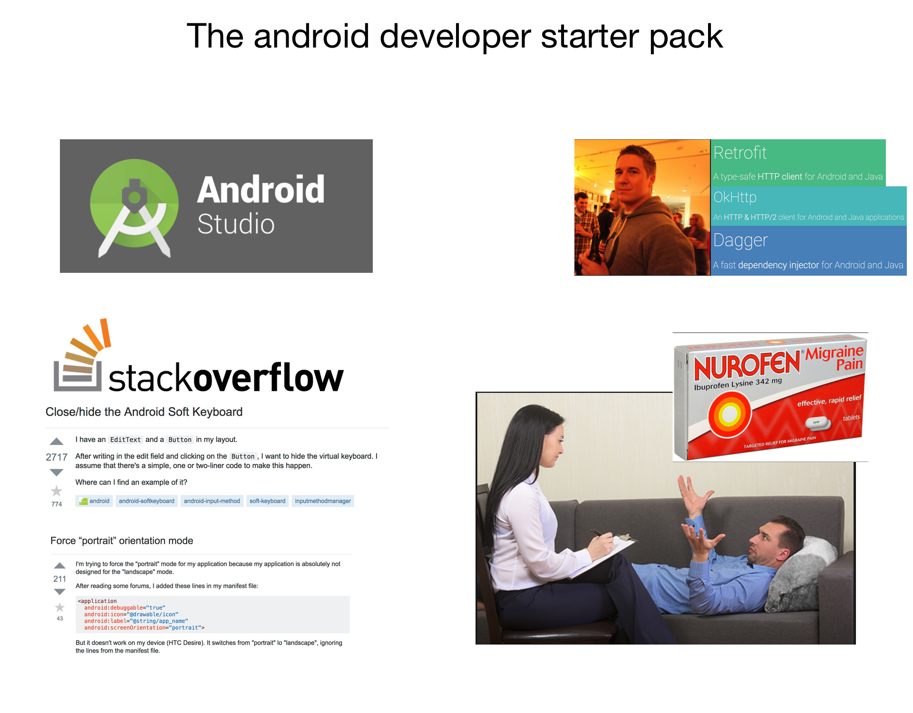


## Further reading

[http://www.bredemeyer.com/whatis.htm](http://www.bredemeyer.com/whatis.htm)

[https://www.youtube.com/watch?v=DngAZyWMGR0](https://www.youtube.com/watch?v=DngAZyWMGR0)

[https://www.techyourchance.com](https://www.techyourchance.com)


## Q&A

Dmitry Melnikov 

melnikovdv@gmail.com

https://t.me/melnikovdv

